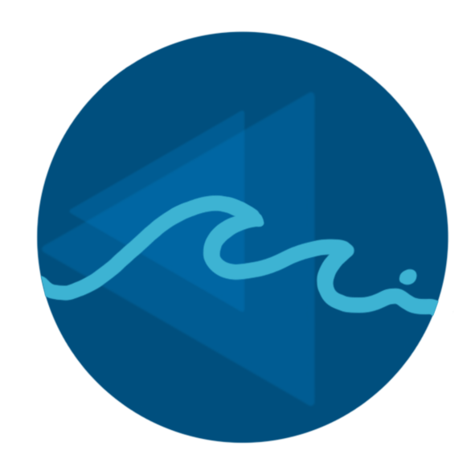
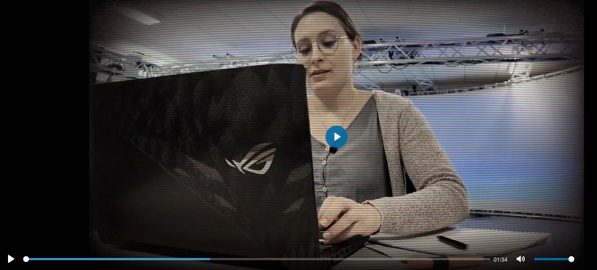

# Aqua Minder 

## Table of Contents

 - [About](#About)
 - [Teaser Video](#Teaser-Video)
 - [Prerequisites](#Prerequisites)
 - [Installation](#Installation)
 - [Usage](#usage)
 - [Contributing](#contributing)
 - [Contact](#contact)

## About

Aqua Minder is a revolutionary product designed to enhance hydration habits and promote a healthier lifestyle. In today's fast world, it's easy to neglect our body's hydration needs. With Aqua Minder, we aim to provide a solution that helps and reminds people to drink more water throughout the day.

Whether you're working diligently in an office or studying intensively at home, Aqua Minder is your reliable companion to keep you hydrated. Upon purchasing our product, you'll receive a carefully curated box containing essential components: the sleek and stylish drink station (black puck), the intelligent smart tag (white card), and easy-to-follow instructions.

The innovative concept behind Aqua Minder involves the use of projection technology. Positioned above the user, a projector displays a visual interface onto the table surface. As you glance down, you'll notice a helpful guide, a ring on the right side, indicating the optimal placement of the drink station, where the drink container is securely placed. This intelligent station goes beyond just holding your beverage, it incorporates advanced weight measurement technology to accurately track the amount of liquid consumed. 

But that's not all! Meet Sunny, our delightful sunflower character located on the left side of the table. Sunny's role is to serve as a friendly reminder to drink water regularly. With its charming animations and gentle nudges, Sunny will guide you throughout the day, encouraging timely hydration breaks and reminding you to take care of yourself.

Aqua Minder revolutionizes the way we approach hydration, making it effortless and enjoyable. By integrating cutting-edge technology with thoughtful design, we empower individuals to establish healthier habits and prioritize their well-being. Say goodbye to dehydration related fatigue and hello to increased energy, focus, and overall vitality.

Join us on this hydration journey and experience the transformative benefits of Aqua Minder. Stay refreshed, stay motivated, and unlock your full potential with every sip. Cheers to a healthier you!

## Teaser Video 

## Prerequisites

- [Unity Game Development Kit (GDK)](https://unity.com/de/download): Aqua Minder is built using Unity. (Mehr info)
- [Visual Studio Code:](https://code.visualstudio.com/download): Node.js v16 or above (Info fehlt)
- [Blender](https://www.blender.org/download/): Our model
- MacOS: Our product runs...

## Installation

1.
2.
3.

## Usage

1. Open the Aqua Minder project in Unity.
2. Build and run the project on your desired platform.
3. 
4. 

## Contributing

Contributions are welcome! If you have any ideas, suggestions, or bug reports, we appreciate any feedback or contributions to make Aqua Minder even better.

## Contact

For any inquiries or further information, please contact the Aqua Minder development team at [email@h-ka.de]
